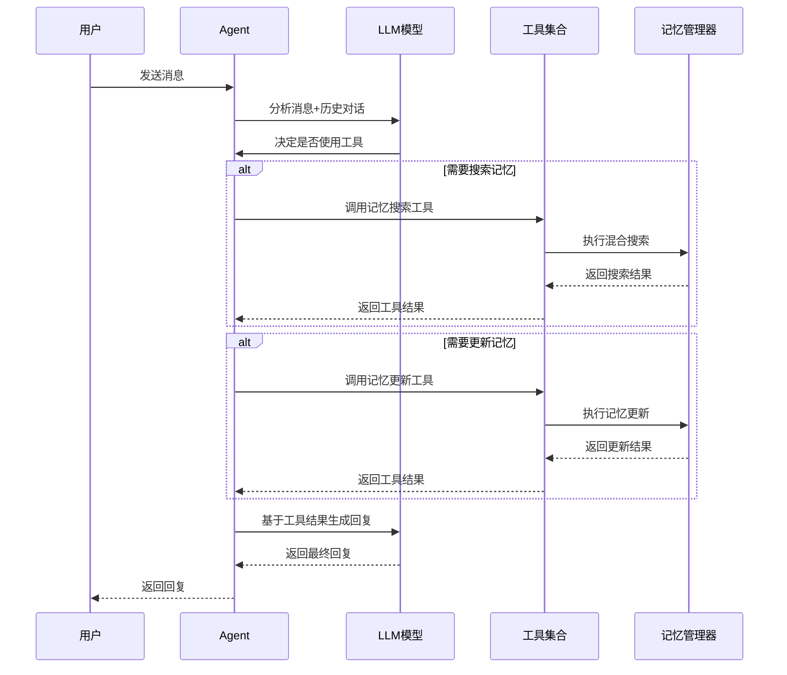

# 🤖 Agent模块

Agent是系统的核心协调器，负责处理用户对话、调用工具、管理记忆等核心功能。

## 📋 模块职责

### 🎯 核心功能
- **对话管理** - 处理用户输入，生成AI回复
- **工具调用** - 智能选择和调用合适的工具
- **记忆集成** - 与记忆管理器协作，实现长期记忆
- **知识提取** - 从对话中提取结构化知识

### 🔧 主要组件

#### Agent结构体
```go
type Agent struct {
    knowledgeExtractor  *tools.KnowledgeExtractorClient  // 知识提取工具
    memorySearcher      *tools.MemorySearchTool          // 记忆搜索工具
    updateMemoryTool    *tools.UpdateMemoryTool          // 记忆更新工具
    conversationalModel model.ToolCallingChatModel       // 对话模型
    memManager          memManager.Manager               // 记忆管理器
    dialogHistory       []*schema.Message                // 对话历史
}
```

## 🔄 工作流程

### 对话处理流程


## 🛠️ 核心方法

### Respond方法
```go
func (a *Agent) Respond(ctx context.Context, userInput string) (string, error)
```
- **功能**: 处理用户输入，返回AI回复
- **流程**: 
  1. 构建对话消息
  2. 调用LLM生成回复
  3. 处理工具调用（如果需要）
  4. 返回最终回复

### IngestAndLearn方法
```go
func (a *Agent) IngestAndLearn(ctx context.Context, content string) (*graphDB.KnowledgeGraph, error)
```
- **功能**: 从文本中提取知识并存储
- **流程**:
  1. 使用知识提取工具分析文本
  2. 转换为图数据库格式
  3. 存储到记忆管理器

### GetMemManager方法
```go
func (a *Agent) GetMemManager() memManager.Manager
```
- **功能**: 获取记忆管理器实例
- **用途**: 供其他组件复用，避免重复初始化

## 🔧 工具集成

### 记忆搜索工具
- **触发条件**: 用户询问过去的信息
- **工具名称**: `search_long_term_memory`
- **功能**: 在记忆库中搜索相关信息

### 记忆更新工具
- **触发条件**: 用户要求修正、补充信息
- **工具名称**: `update_memory`
- **功能**: 实时更新记忆内容

### 知识提取工具
- **使用场景**: 处理新的文本内容
- **功能**: 提取实体、关系等结构化信息

## 📊 配置参数

### LLM配置
- **模型**: 通过configger.GraphModelName配置
- **工具选择**: 支持强制工具调用和自动选择
- **对话历史**: 维护完整的对话上下文

### 错误处理
- **工具调用失败**: 自动降级处理
- **LLM调用失败**: 返回详细错误信息
- **记忆操作失败**: 不影响基本对话功能

## 🧪 测试

### 单元测试
```bash
go test ./internal/agent
```

### 集成测试
```bash
# 测试完整对话流程
go run test_update_memory.go
```

## 📝 使用示例

### 基本对话
```go
agent, err := agent.New(ctx)
if err != nil {
    log.Fatal(err)
}

response, err := agent.Respond(ctx, "你好，我是张三")
if err != nil {
    log.Fatal(err)
}

fmt.Println(response)
```

### 知识摄取
```go
knowledge, err := agent.IngestAndLearn(ctx, "张三是一名软件工程师")
if err != nil {
    log.Fatal(err)
}

fmt.Printf("提取了 %d 个实体和 %d 个关系\n", 
    len(knowledge.Nodes), len(knowledge.Edges))
```

## 🔗 依赖关系

- **LLM**: eino框架的ChatModel
- **Tools**: 各种AI工具的客户端
- **MemManager**: 记忆管理器接口
- **GraphDB**: 知识图谱数据结构

## 📈 性能优化

- **对话历史管理**: 自动清理过长的历史记录
- **工具调用缓存**: 避免重复的工具调用
- **错误恢复**: 快速从工具调用失败中恢复
