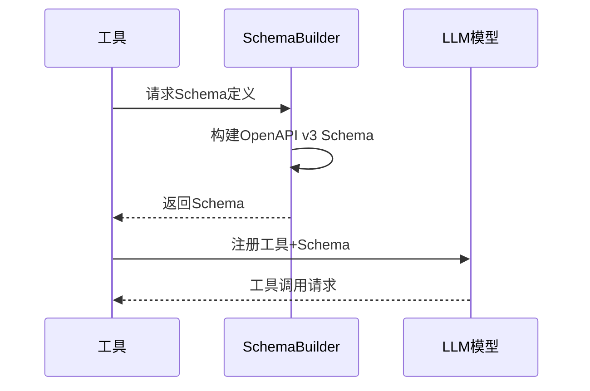
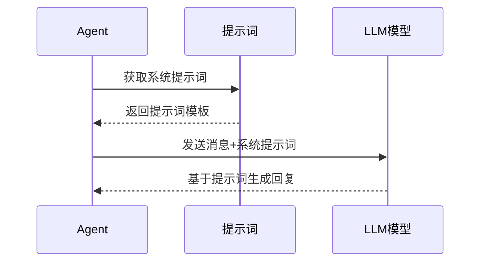

# 🧠 LLM模块

LLM模块负责与大语言模型的集成，包括模型配置、提示词管理、Schema定义和模型调用等核心功能。

## 📋 模块职责

### 🎯 核心功能
- **模型集成** - 集成各种LLM提供商（OpenAI、Claude等）
- **提示词管理** - 管理系统和工具的提示词模板
- **Schema定义** - 定义工具调用的参数Schema
- **模型配置** - 管理模型参数和调用配置

## 📁 文件结构

```
internal/llm/
├── provider.go          # LLM提供商集成
├── prompt.go           # 提示词定义
├── schemaBuilder.go    # 工具Schema构建
└── README.md          # 本文档
```

## 🔧 核心组件

### 1. Provider (模型提供商)
**文件**: `provider.go`

#### 功能描述
统一的LLM提供商接口，支持多种模型提供商的集成。

#### 接口定义
```go
type Provider interface {
    GetBaseModel() model.ChatModel
    GetToolCallingModel() model.ToolCallingChatModel
}
```

#### 支持的提供商
- **OpenAI**: GPT-3.5, GPT-4系列
- **Claude**: Claude-3系列
- **本地模型**: 通过eino框架支持

#### 使用示例
```go
provider, err := llm.NewProvider(ctx)
if err != nil {
    log.Fatal(err)
}

baseModel := provider.GetBaseModel()
toolModel := provider.GetToolCallingModel()
```

### 2. Prompt (提示词管理)
**文件**: `prompt.go`

#### 系统提示词

##### AgentSystemPrompt
主要的Agent系统提示词，指导AI如何使用工具和记忆。

**核心指导原则**:
- 记忆搜索优先原则
- 记忆更新触发条件
- 工具使用最佳实践

**记忆搜索原则**:
```
1. 当用户问及具体的人名、项目名、技术栈、个人经历等信息时，优先使用 search_long_term_memory 工具
2. 不要直接说"我不知道"或"我没有访问权限"，而是先搜索记忆
3. 基于搜索到的记忆内容来回答问题
4. 如果搜索后仍然没有找到相关信息，再礼貌地说明
```

**记忆更新原则**:
```
何时更新记忆：
1. 信息修正：用户说"不对"、"我说错了"、"其实是..."、"应该是..."
2. 信息补充：用户说"对了"、"还有"、"补充一下"、"另外"
3. 信息更新：用户提到状态变化、进展更新、关系变化
4. 明确要求：用户直接说"更新一下"、"修改记忆"、"记录新信息"
```

##### MemoryRecoverySystemPrompt
专门用于记忆回收的系统提示词。

**分析维度**:
- 对话整体价值评估
- 个人信息识别
- 技术信息识别
- 项目信息识别
- 工作内容识别

**评分标准**:
- 0-3分: 无价值内容（寒暄、测试）
- 4-6分: 一般价值内容
- 7-10分: 高价值内容（值得长期保存）

### 3. SchemaBuilder (Schema构建器)
**文件**: `schemaBuilder.go`

#### 功能描述
为所有AI工具构建OpenAPI v3 Schema，确保LLM能正确理解和调用工具。

#### 支持的Schema

##### 记忆搜索Schema
```go
func BuildMemorySearchSchema() *openapi3.Schema
```
- **query**: 搜索查询字符串
- **验证**: 必填字段，长度限制

##### 记忆更新Schema
```go
func BuildUpdateMemorySchema() *openapi3.Schema
```
- **query**: 搜索要更新的记忆
- **action**: 更新动作类型（update/append/correct/delete）
- **new_content**: 新的内容
- **reason**: 更新原因

##### 知识提取Schema
```go
func BuildKnowledgeExtractionSchema() *openapi3.Schema
```
- **text**: 要提取知识的文本
- **extract_entities**: 是否提取实体
- **extract_relations**: 是否提取关系

##### 记忆回收Schema
```go
func BuildMemoryRecoverySchema() *openapi3.Schema
```
- **conversation_analysis**: 对话整体分析
- **worthy_segments**: 值得保存的片段列表

## 📊 数据结构

### 知识提取结果
```go
type ExtractedKnowledge struct {
    Entities  []Entity   `json:"entities"`
    Relations []Relation `json:"relations"`
}

type Entity struct {
    Name       string          `json:"name"`
    Labels     []string        `json:"labels"`
    Properties json.RawMessage `json:"properties"`
}

type Relation struct {
    Subject    string          `json:"subject"`
    Predicate  string          `json:"predicate"`
    Object     string          `json:"object"`
    Properties json.RawMessage `json:"properties"`
}
```

### 记忆回收结果
```go
type MemoryRecoveryResult struct {
    ConversationAnalysis ConversationAnalysis `json:"conversation_analysis"`
    WorthySegments      []WorthySegment      `json:"worthy_segments"`
}

type ConversationAnalysis struct {
    OverallValue        int      `json:"overall_value"`
    HasPersonalInfo     bool     `json:"has_personal_info"`
    HasTechnicalInfo    bool     `json:"has_technical_info"`
    HasProjectInfo      bool     `json:"has_project_info"`
    ConversationThemes  []string `json:"conversation_themes"`
    Summary            string   `json:"summary"`
}
```

## 🔄 工作流程

### 工具Schema生成流程


### 提示词应用流程


## 🧪 测试

### Schema验证测试
```bash
# 测试Schema构建
go test ./internal/llm -run TestSchemaBuilder
```

### 提示词测试
```bash
# 测试提示词效果
go run test_update_memory.go
```

## 📝 使用示例

### 创建LLM提供商
```go
provider, err := llm.NewProvider(ctx)
if err != nil {
    log.Fatal(err)
}

// 获取基础模型
baseModel := provider.GetBaseModel()

// 获取工具调用模型
toolModel := provider.GetToolCallingModel()
```

### 构建工具Schema
```go
// 构建记忆搜索Schema
searchSchema := llm.BuildMemorySearchSchema()

// 构建记忆更新Schema
updateSchema := llm.BuildUpdateMemorySchema()

// 创建工具信息
toolInfo := &schema.ToolInfo{
    Name:        "search_memory",
    Desc:        "搜索长期记忆",
    ParamsOneOf: schema.NewParamsOneOfByOpenAPIV3(searchSchema),
}
```

### 使用系统提示词
```go
// 获取Agent系统提示词
systemPrompt := llm.AgentSystemPrompt

// 创建消息
messages := []*schema.Message{
    schema.SystemMessage(systemPrompt),
    schema.UserMessage("用户输入"),
}

// 调用模型
response, err := model.Generate(ctx, messages)
```

## 🔗 依赖关系

### 外部依赖
- **eino框架**: 模型调用和工具集成
- **OpenAPI v3**: Schema定义标准
- **各种LLM提供商**: OpenAI、Claude等

### 内部依赖
- **Configger**: 模型配置管理
- **Tools**: 工具定义和实现

## ⚠️ 注意事项

### 提示词设计
- 保持提示词的简洁和明确
- 避免过于复杂的指令
- 定期测试和优化提示词效果

### Schema定义
- 确保Schema的完整性和准确性
- 提供清晰的字段描述
- 设置合理的验证规则

### 模型配置
- 根据任务选择合适的模型
- 设置合理的参数（温度、最大长度等）
- 监控模型调用的成本和性能
