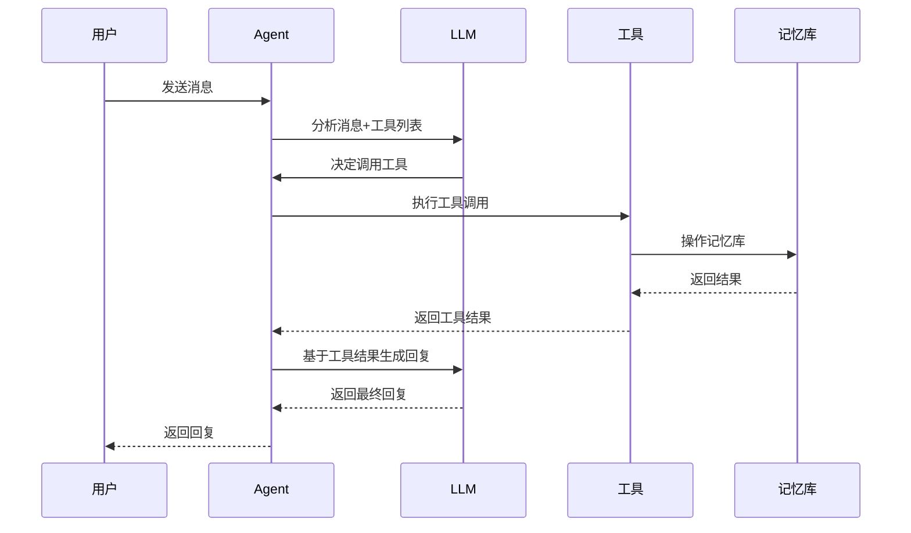
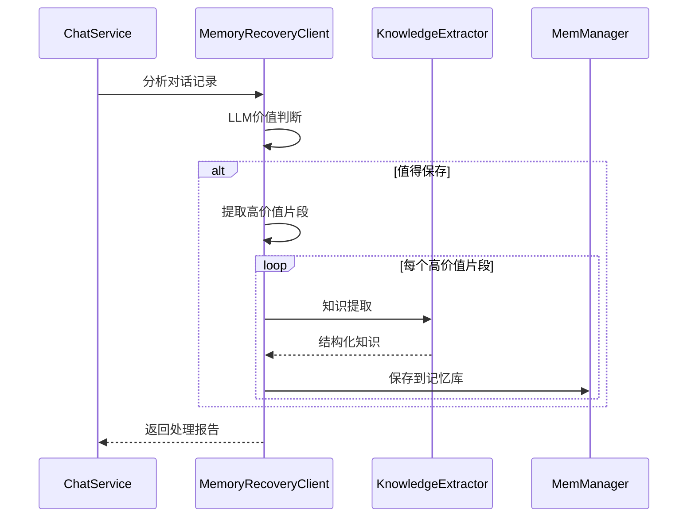

# 🛠️ Tools模块

Tools模块包含了所有AI可以调用的工具，包括记忆搜索、记忆更新、知识提取和记忆回收等核心功能。

## 📋 模块职责

### 🎯 核心功能
- **记忆搜索工具** - 在长期记忆中搜索相关信息
- **记忆更新工具** - 实时修正和补充记忆内容
- **知识提取工具** - 从文本中提取结构化知识
- **记忆回收工具** - 智能判断对话价值并选择性保存

## 🔧 工具列表

### 1. MemorySearchTool (记忆搜索工具)
**文件**: `memoryTool.go`
**工具名**: `search_long_term_memory`

#### 功能描述
在长期记忆库中搜索与查询相关的信息，支持混合检索（图谱+向量）。

#### 参数结构
```go
type MemorySearchInput struct {
    Query string `json:"query" jsonschema:"required,description=搜索查询字符串"`
}
```

#### 使用场景
- 用户询问过去的对话内容
- 查找特定的人物、项目、技术信息
- 回忆历史决策和经验

#### 示例
```json
{
  "query": "张三的项目"
}
```

### 2. UpdateMemoryTool (记忆更新工具)
**文件**: `updateMemoryTool.go`
**工具名**: `update_memory`

#### 功能描述
实时更新记忆内容，支持修正、补充、删除等操作。

#### 参数结构
```go
type UpdateMemoryRequest struct {
    Query      string `json:"query" jsonschema:"required,description=用于搜索要更新的记忆"`
    Action     string `json:"action" jsonschema:"required,description=更新动作类型"`
    NewContent string `json:"new_content" jsonschema:"required,description=新的内容"`
    Reason     string `json:"reason" jsonschema:"description=更新原因"`
}
```

#### 支持的动作
- `update`: 完全更新/替换信息
- `append`: 追加新信息
- `correct`: 修正错误信息
- `delete`: 删除信息

#### 使用场景
- 用户说"不对，我说错了..."
- 用户说"补充一下..."
- 用户要求删除某些信息

#### 示例
```json
{
  "query": "张三",
  "action": "correct",
  "new_content": "张三是我的技术顾问",
  "reason": "用户修正了张三的角色"
}
```

### 3. KnowledgeExtractorClient (知识提取工具)
**文件**: `knowledgeExtraction.go`
**工具名**: 内部工具（不直接暴露给LLM）

#### 功能描述
从文本中提取结构化知识，包括实体、关系和属性。

#### 提取内容
- **实体**: 人物、地点、组织、概念等
- **关系**: 实体间的关联关系
- **属性**: 实体的特征和属性

#### 使用场景
- Agent处理新的文本内容
- 记忆回收时的知识结构化
- 文档摄取和学习

### 4. MemoryRecoveryClient (记忆回收工具)
**文件**: `memoryRecovery.go`
**工具名**: 内部工具（不直接暴露给LLM）

#### 功能描述
智能分析对话记录，判断哪些内容值得保存到长期记忆库。

#### 分析维度
- **整体价值评分** (0-10分)
- **内容类型识别** (个人信息、技术信息、项目信息)
- **片段价值评估** (每个片段的独立评分)
- **知识提取** (自动提取结构化信息)

#### 使用场景
- 程序优雅退出时的记忆回收
- 定期的记忆整理和优化
- 对话质量评估

## 🔄 工具调用流程

### LLM工具调用流程


### 记忆回收流程


## 📊 工具配置

### Schema定义
所有工具的参数Schema都在`internal/llm/schemaBuilder.go`中定义：

- `BuildMemorySearchSchema()` - 记忆搜索工具Schema
- `BuildUpdateMemorySchema()` - 记忆更新工具Schema
- `BuildKnowledgeExtractionSchema()` - 知识提取工具Schema
- `BuildMemoryRecoverySchema()` - 记忆回收工具Schema

### Prompt指导
工具使用的Prompt指导在`internal/llm/prompt.go`中定义：

- `AgentSystemPrompt` - 主要的工具使用指导
- `MemoryRecoverySystemPrompt` - 记忆回收专用指导

## 🧪 测试

### 单元测试
```bash
# 测试记忆搜索
go test ./internal/tools -run TestMemorySearch

# 测试记忆更新
go test ./internal/tools -run TestUpdateMemory
```

### 集成测试
```bash
# 测试记忆更新功能
go run test_update_memory.go

# 测试记忆回收功能
go run test_memory_recovery.go
```

## 📝 使用示例

### 创建记忆搜索工具
```go
memManager, _ := memManager.New()
searchTool, err := tools.NewMemorySearchTool(memManager)
if err != nil {
    log.Fatal(err)
}

// 执行搜索
input := &tools.MemorySearchInput{Query: "张三"}
result, err := searchTool.GoFunc(ctx, input)
```

### 创建记忆更新工具
```go
updateTool, err := tools.NewUpdateMemoryTool(memManager)
if err != nil {
    log.Fatal(err)
}

// 执行更新
params := `{"query": "张三", "action": "correct", "new_content": "张三是技术顾问"}`
result, err := updateTool.Execute(ctx, params)
```

### 创建知识提取工具
```go
llmProvider, _ := llm.NewProvider(ctx)
extractor, err := tools.NewKnowledgeExtractorClient(llmProvider)
if err != nil {
    log.Fatal(err)
}

// 提取知识
knowledge, err := extractor.Extract(ctx, "张三是一名软件工程师")
```

## 🔗 依赖关系

### 外部依赖
- **eino框架**: 工具调用和LLM集成
- **MemManager**: 记忆管理器接口
- **LLM Provider**: 语言模型提供者

### 内部依赖
- **Schema Builder**: 工具参数定义
- **Prompt**: 工具使用指导
- **GraphDB**: 知识图谱数据结构

## ⚠️ 注意事项

### 工具安全
- 所有工具都有参数验证
- 错误处理和日志记录完整
- 避免恶意输入和注入攻击

### 性能优化
- 工具调用结果缓存
- 批量操作支持
- 异步处理能力

### 扩展性
- 新工具添加简单
- Schema定义标准化
- 工具间解耦设计
