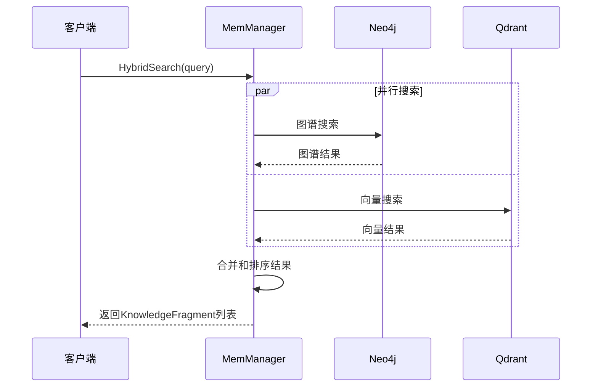
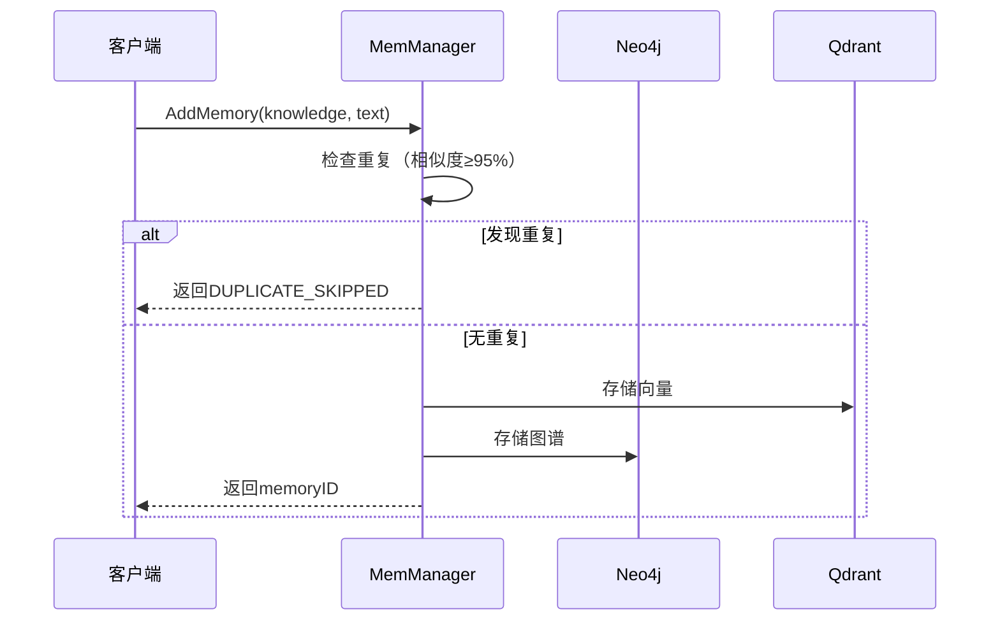

# 💾 MemManager模块

记忆管理器是系统的数据存储和检索核心，负责管理Neo4j图数据库和Qdrant向量数据库的所有操作。

## 📋 模块职责

### 🎯 核心功能
- **混合存储** - 同时管理图数据库和向量数据库
- **混合检索** - 结合图谱查询和向量搜索
- **记忆管理** - 添加、更新、删除记忆
- **去重机制** - 避免重复记忆累积

### 🏗️ 架构设计

```
┌─────────────────────────────────────┐
│           MemManager                │
├─────────────────────────────────────┤
│  • HybridSearch                     │
│  • AddMemory                        │
│  • UpdateMemory                     │
│  • DeleteMemory                     │
│  • ClearAllData                     │
└─────────────────┬───────────────────┘
                  │
    ┌─────────────┼─────────────┐
    │             │             │
┌───▼────┐  ┌─────▼─────┐  ┌───▼────┐
│GraphDB │  │   VecX    │  │  LLM   │
│        │  │           │  │        │
│• Neo4j │  │ • Qdrant  │  │• 知识  │
│• 图谱  │  │ • 向量    │  │  提取  │
│• 关系  │  │ • 语义    │  │• 分析  │
└────────┘  └───────────┘  └────────┘
```

## 🔧 核心接口

### Manager接口
```go
type Manager interface {
    // 添加记忆（接收已提取的知识图谱）
    AddMemory(ctx context.Context, knowledge *graphDB.KnowledgeGraph, originalText string) (string, error)
    
    // 混合搜索（返回知识片段）
    HybridSearch(ctx context.Context, queryText string, topK uint64) ([]*KnowledgeFragment, error)
    
    // 更新记忆
    UpdateMemory(ctx context.Context, id, newMemoryText string) error
    
    // 删除记忆
    DeleteMemory(ctx context.Context, id string) error
    
    // 清空所有数据
    ClearAllData(ctx context.Context) error
    
    // 关闭连接
    Close()
}
```

## 📊 数据结构

### KnowledgeFragment
```go
type KnowledgeFragment struct {
    ID        string  // 记忆的唯一标识符
    Source    string  // "graph" or "vector"
    Content   string  // 直接答案或原始记忆文本
    Certainty float32 // 相似度分数
}
```

## 🔄 核心流程

### 混合搜索流程


### 记忆存储流程


## 🛠️ 核心方法详解

### AddMemory方法
```go
func (m *managerImpl) AddMemory(ctx context.Context, knowledge *graphDB.KnowledgeGraph, originalText string) (string, error)
```

**功能**: 添加新记忆到系统
**去重机制**: 
- 检查语义相似度（阈值95%）
- 发现重复则跳过存储
- 返回特殊标识`DUPLICATE_SKIPPED`

**存储流程**:
1. 生成唯一记忆ID
2. 向量化文本并存储到Qdrant
3. 存储结构化知识到Neo4j
4. 返回记忆ID

### HybridSearch方法
```go
func (m *managerImpl) HybridSearch(ctx context.Context, queryText string, topK uint64) ([]*KnowledgeFragment, error)
```

**功能**: 混合搜索记忆
**搜索策略**:
1. **图谱搜索**: 基于实体名称的精确匹配
2. **向量搜索**: 基于语义相似度的模糊匹配
3. **结果合并**: 去重并按相关性排序

### ClearAllData方法
```go
func (m *managerImpl) ClearAllData(ctx context.Context) error
```

**功能**: 一键清空所有数据
**清空策略**:
1. **Neo4j**: 通过HTTP API执行`MATCH (n) DETACH DELETE n`
2. **Qdrant**: 删除并重新创建集合
3. **错误处理**: 部分失败不影响其他操作

## 🔍 搜索优化

### 图谱搜索
- **实体匹配**: 基于实体名称的模糊匹配
- **关系遍历**: 查找相关的记忆节点
- **结果过滤**: 只返回有意义的记忆文本

### 向量搜索
- **语义编码**: 使用ONNX模型进行文本向量化
- **相似度计算**: 基于余弦相似度
- **结果排序**: 按相似度分数降序排列

## 📈 性能特性

### 并发安全
- 所有方法都是线程安全的
- 支持并发读写操作

### 资源管理
- 自动管理数据库连接
- 优雅关闭和资源清理

### 错误处理
- 完整的错误传播
- 详细的日志记录

## 🧪 测试

### 功能测试
```bash
# 测试基本功能
go run test_clear_data.go

# 测试去重机制
go run test_deduplication.go
```

### 性能测试
```bash
# 测试搜索性能
go test -bench=BenchmarkHybridSearch ./internal/memManager
```

## 📝 使用示例

### 基本使用
```go
// 创建管理器
manager, err := memManager.New()
if err != nil {
    log.Fatal(err)
}
defer manager.Close()

// 添加记忆
knowledge := &graphDB.KnowledgeGraph{
    Nodes: []graphDB.Node{{Name: "张三", Labels: []string{"Person"}}},
    Edges: []graphDB.Edge{},
}
memoryID, err := manager.AddMemory(ctx, knowledge, "张三是一名工程师")

// 搜索记忆
fragments, err := manager.HybridSearch(ctx, "张三", 5)
for _, fragment := range fragments {
    fmt.Printf("来源: %s, 内容: %s, 相似度: %.3f\n", 
        fragment.Source, fragment.Content, fragment.Certainty)
}
```

### 清空数据
```go
err := manager.ClearAllData(ctx)
if err != nil {
    log.Printf("清空失败: %v", err)
}
```

## 🔗 依赖关系

- **GraphDB**: Neo4j图数据库操作
- **VecX**: Qdrant向量数据库操作
- **HTTP Client**: 用于数据库管理API调用

## ⚠️ 注意事项

- **ONNX Runtime**: 只能初始化一次，需要复用实例
- **数据一致性**: 图数据库和向量数据库需要保持同步
- **资源清理**: 使用完毕后必须调用Close()方法
