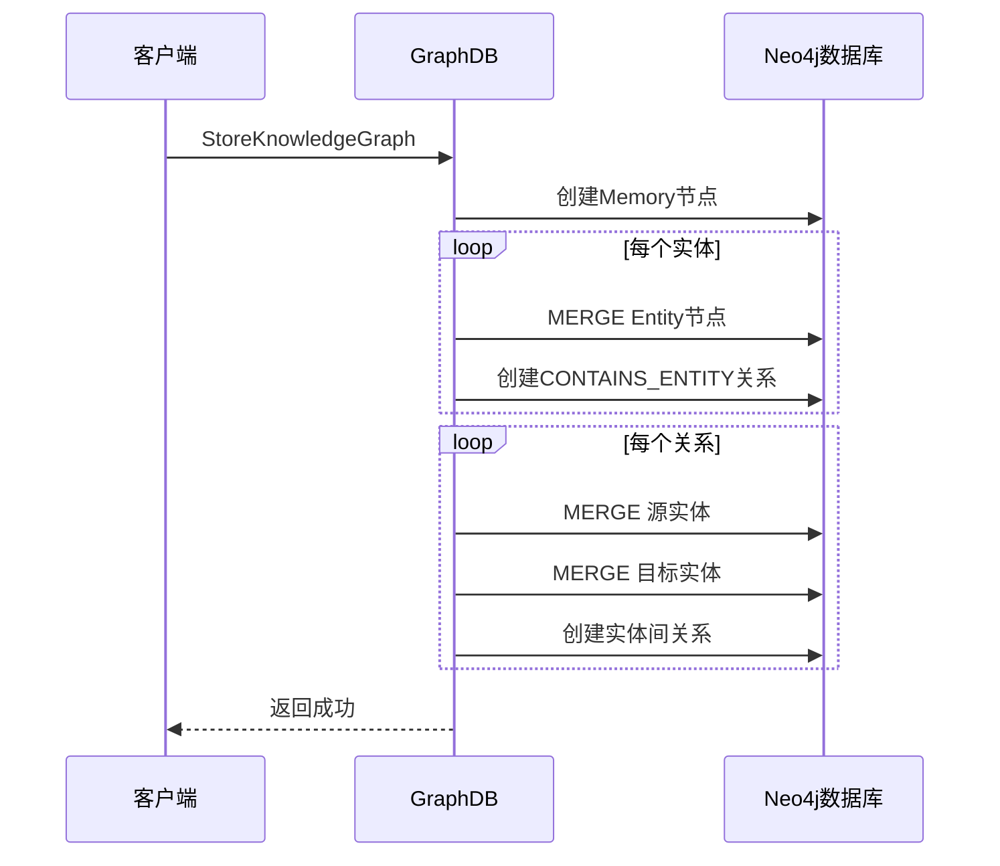
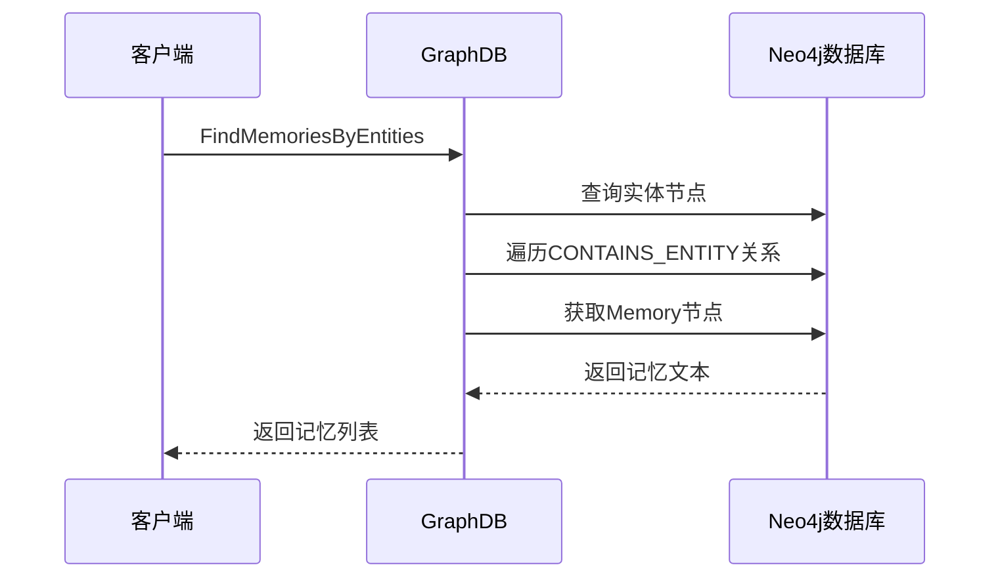

# 🕸️ GraphDB模块

GraphDB模块负责Neo4j图数据库的所有操作，包括知识图谱存储、实体关系管理、图谱查询等功能。

## 📋 模块职责

### 🎯 核心功能
- **知识图谱存储** - 存储实体、关系和记忆节点
- **图谱查询** - 基于实体和关系的复杂查询
- **记忆管理** - 管理Memory节点和相关关系
- **数据维护** - 更新、删除和清理图谱数据

## 🏗️ 数据模型

### 节点类型

#### Memory节点
```cypher
(:Memory {
  id: "memory_uuid",
  text: "原始记忆文本",
  timestamp: 1642678800
})
```

#### Entity节点
```cypher
(:Entity {
  name: "实体名称"
})

# 带标签的实体
(:Entity:Person {
  name: "张三",
  role: "工程师"
})

(:Entity:Project {
  name: "智能助手",
  status: "开发中"
})
```

### 关系类型

#### CONTAINS_ENTITY关系
```cypher
(memory:Memory)-[:CONTAINS_ENTITY]->(entity:Entity)
```
表示记忆包含某个实体。

#### 实体间关系
```cypher
(person:Entity:Person)-[:WORKS_ON]->(project:Entity:Project)
(person:Entity:Person)-[:PARTNER_WITH]->(partner:Entity:Person)
(project:Entity:Project)-[:USES_TECHNOLOGY]->(tech:Entity:Technology)
```

## 🔧 核心接口

### Service接口
```go
type Service interface {
    // 存储知识图谱
    StoreKnowledgeGraph(ctx context.Context, memoryID, originalText string, timestamp int64, kg *KnowledgeGraph) error
    
    // 根据实体查找记忆
    FindMemoriesByEntities(ctx context.Context, entityNames []string) ([]string, error)
    
    // 更新记忆节点
    UpdateMemoryNode(ctx context.Context, id, newText string, newTimestamp int64, newEntities []string) error
    
    // 删除记忆
    DeleteMemory(ctx context.Context, memoryID string) error
    
    // 关闭连接
    Close()
}
```

## 📊 数据结构

### KnowledgeGraph
```go
type KnowledgeGraph struct {
    Nodes []Node `json:"nodes"`
    Edges []Edge `json:"edges"`
}
```

### Node
```go
type Node struct {
    Name       string                 `json:"name"`
    Labels     []string               `json:"labels"`
    Properties map[string]interface{} `json:"properties"`
}
```

### Edge
```go
type Edge struct {
    FromNodeName string                 `json:"from_node_name"`
    ToNodeName   string                 `json:"to_node_name"`
    Type         string                 `json:"type"`
    Properties   map[string]interface{} `json:"properties"`
}
```

## 🔄 核心流程

### 知识图谱存储流程


### 记忆查询流程


## 🛠️ 核心方法详解

### StoreKnowledgeGraph方法
```go
func (s *serviceImpl) StoreKnowledgeGraph(ctx context.Context, memoryID, originalText string, timestamp int64, kg *KnowledgeGraph) error
```

**功能**: 存储完整的知识图谱
**存储策略**:
1. 创建Memory节点
2. 使用MERGE创建/更新实体节点
3. 创建Memory到Entity的关系
4. 创建实体间的关系

**Cypher示例**:
```cypher
// 创建Memory节点
CREATE (m:Memory {id: $memoryID, text: $text, timestamp: $timestamp})

// 创建实体和关系
MERGE (e:Entity {name: $entityName})
SET e += $properties
MERGE (m)-[:CONTAINS_ENTITY]->(e)

// 创建实体间关系
MATCH (from:Entity {name: $fromName}), (to:Entity {name: $toName})
MERGE (from)-[r:RELATIONSHIP_TYPE]->(to)
SET r += $properties
```

### FindMemoriesByEntities方法
```go
func (s *serviceImpl) FindMemoriesByEntities(ctx context.Context, entityNames []string) ([]string, error)
```

**功能**: 根据实体名称查找相关记忆
**查询策略**:
1. 模糊匹配实体名称
2. 遍历CONTAINS_ENTITY关系
3. 返回相关的记忆文本

**Cypher示例**:
```cypher
MATCH (e:Entity)-[:CONTAINS_ENTITY]-(m:Memory)
WHERE ANY(name IN $entityNames WHERE e.name CONTAINS name)
RETURN DISTINCT m.text
ORDER BY m.timestamp DESC
LIMIT 10
```

### UpdateMemoryNode方法
```go
func (s *serviceImpl) UpdateMemoryNode(ctx context.Context, id, newText string, newTimestamp int64, newEntities []string) error
```

**功能**: 更新记忆节点和相关关系
**更新策略**:
1. 更新Memory节点属性
2. 删除所有旧的CONTAINS_ENTITY关系
3. 重建新的实体关系

**Cypher示例**:
```cypher
// 更新Memory节点
MATCH (m:Memory {id: $id})
SET m.text = $newText, m.timestamp = $newTimestamp

// 删除旧关系
OPTIONAL MATCH (m)-[r:CONTAINS_ENTITY]->(oldE:Entity)
DELETE r

// 创建新关系
UNWIND $newEntities AS entityName
MERGE (e:Entity {name: entityName})
MERGE (m)-[:CONTAINS_ENTITY]->(e)
```

## 🔍 查询优化

### 索引策略
```cypher
// 实体名称索引
CREATE INDEX entity_name_index FOR (e:Entity) ON (e.name)

// Memory ID索引
CREATE INDEX memory_id_index FOR (m:Memory) ON (m.id)

// 时间戳索引
CREATE INDEX memory_timestamp_index FOR (m:Memory) ON (m.timestamp)
```

### 查询性能
- **实体查找**: 使用索引加速名称匹配
- **关系遍历**: 优化图遍历路径
- **结果限制**: 设置合理的LIMIT避免大结果集

## 🧪 测试

### 单元测试
```bash
go test ./internal/graphDB
```

### 集成测试
```bash
# 测试完整的存储和查询流程
go run test_graph_operations.go
```

## 📝 使用示例

### 基本使用
```go
// 创建服务
service, err := graphDB.New()
if err != nil {
    log.Fatal(err)
}
defer service.Close()

// 构建知识图谱
kg := &graphDB.KnowledgeGraph{
    Nodes: []graphDB.Node{
        {
            Name:   "张三",
            Labels: []string{"Person"},
            Properties: map[string]interface{}{
                "role": "工程师",
                "age":  30,
            },
        },
    },
    Edges: []graphDB.Edge{
        {
            FromNodeName: "张三",
            ToNodeName:   "智能助手项目",
            Type:         "WORKS_ON",
            Properties:   map[string]interface{}{},
        },
    },
}

// 存储知识图谱
err = service.StoreKnowledgeGraph(ctx, "memory_001", "张三在做智能助手项目", time.Now().Unix(), kg)
if err != nil {
    log.Fatal(err)
}

// 查询记忆
memories, err := service.FindMemoriesByEntities(ctx, []string{"张三"})
for _, memory := range memories {
    fmt.Println(memory)
}
```

### 高级查询
```go
// 查找多个实体的交集
entities := []string{"张三", "智能助手"}
memories, err := service.FindMemoriesByEntities(ctx, entities)

// 更新记忆
err = service.UpdateMemoryNode(ctx, "memory_001", "张三是智能助手项目的主要开发者", time.Now().Unix(), []string{"张三", "智能助手", "开发者"})
```

## 🔗 依赖关系

### 外部依赖
- **Neo4j Driver**: 官方Go驱动程序
- **Neo4j数据库**: 图数据库服务

### 内部依赖
- **Configger**: 数据库连接配置

## ⚠️ 注意事项

### 数据一致性
- 使用事务确保操作的原子性
- MERGE操作避免重复节点创建
- 关系更新时注意孤儿节点清理

### 性能优化
- 合理使用索引加速查询
- 避免深度图遍历
- 设置查询超时和结果限制

### 安全考虑
- 参数化查询防止Cypher注入
- 连接池管理避免连接泄露
- 敏感数据加密存储
