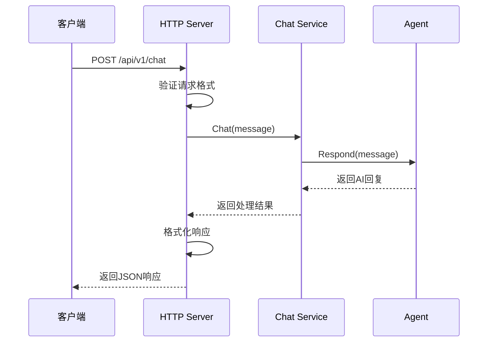
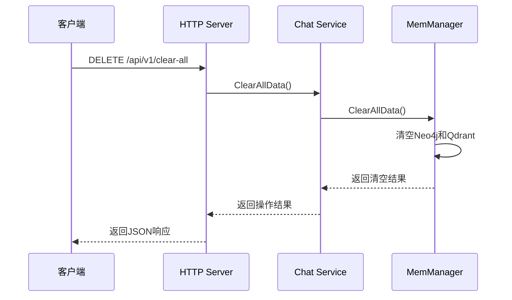

# 🌐 Server模块

Server模块提供HTTP API服务，是系统与外部交互的主要接口，基于Gin框架构建RESTful API。

## 📋 模块职责

### 🎯 核心功能
- **HTTP API服务** - 提供RESTful API接口
- **请求路由** - 管理API路由和中间件
- **请求处理** - 处理HTTP请求和响应
- **错误处理** - 统一的错误处理和响应格式

## 🔧 API接口

### 聊天接口

#### POST /api/v1/chat
**功能**: 发送消息给AI助手

**请求格式**:
```json
{
  "message": "你好，我是张三"
}
```

**响应格式**:
```json
{
  "reply": "你好张三！很高兴认识你。",
  "timestamp": "2025-07-20T14:30:00Z",
  "success": true
}
```

**错误响应**:
```json
{
  "success": false,
  "error": "Invalid request format"
}
```

#### GET /api/v1/status
**功能**: 获取服务状态信息

**响应格式**:
```json
{
  "status": "running",
  "uptime": "2h30m15s",
  "message_count": 42,
  "conversation_size": 15,
  "last_activity": "2025-07-20T14:29:45Z"
}
```

### 管理接口

#### DELETE /api/v1/clear-all
**功能**: 清空所有记忆数据

**响应格式**:
```json
{
  "success": true,
  "message": "所有记忆数据已成功清空",
  "timestamp": "2025-07-20T14:30:00Z"
}
```

**错误响应**:
```json
{
  "success": false,
  "error": "清空数据失败: 具体错误信息"
}
```

### 系统接口

#### GET /health
**功能**: 健康检查

**响应格式**:
```json
{
  "status": "healthy",
  "time": "2025-07-20T14:30:00Z"
}
```

## 🏗️ 架构设计

```
┌─────────────────────────────────────┐
│            HTTP Server              │
├─────────────────────────────────────┤
│  • Gin Router                       │
│  • Middleware                       │
│  • Request Handlers                 │
│  • Response Formatters              │
└─────────────┬───────────────────────┘
              │
    ┌─────────▼─────────┐
    │   Chat Service    │
    │                   │
    │ • 对话管理        │
    │ • 记忆回收        │
    │ • 状态统计        │
    └───────────────────┘
```

## 🔄 请求处理流程

### 聊天请求流程


### 清空数据流程


## 🛠️ 核心组件

### Server结构体
```go
type Server struct {
    httpServer  *http.Server
    chatService *service.ChatService
}
```

### 请求/响应结构

#### ChatRequest
```go
type ChatRequest struct {
    Message string `json:"message" binding:"required"`
}
```

#### ChatResponse
```go
type ChatResponse struct {
    Reply     string `json:"reply"`
    Timestamp string `json:"timestamp"`
    Success   bool   `json:"success"`
    Error     string `json:"error,omitempty"`
}
```

## 🔧 核心方法

### setupRoutes方法
```go
func (s *Server) setupRoutes(router *gin.Engine)
```

**功能**: 设置所有API路由
**路由配置**:
- 健康检查路由
- API v1路由组
- 静态文件服务
- 错误处理中间件

### handleChat方法
```go
func (s *Server) handleChat(c *gin.Context)
```

**功能**: 处理聊天请求
**处理流程**:
1. 验证请求格式
2. 调用ChatService
3. 格式化响应
4. 错误处理

### handleClearAll方法
```go
func (s *Server) handleClearAll(c *gin.Context)
```

**功能**: 处理清空数据请求
**安全考虑**:
- 记录操作日志
- 确认操作权限
- 详细错误信息

## 📊 中间件

### 日志中间件
- 记录所有HTTP请求
- 包含请求时间、方法、路径、状态码
- 性能监控和调试支持

### 恢复中间件
- 捕获panic异常
- 返回500错误响应
- 防止服务崩溃

### CORS中间件（可选）
- 跨域请求支持
- 安全头设置
- 预检请求处理

## 🔒 安全特性

### 输入验证
- JSON格式验证
- 必填字段检查
- 数据类型验证

### 错误处理
- 统一错误响应格式
- 敏感信息过滤
- 详细日志记录

### 限流保护（建议）
- 请求频率限制
- IP白名单/黑名单
- 防止恶意攻击

## 📈 性能优化

### 连接管理
- HTTP Keep-Alive支持
- 连接池优化
- 超时设置

### 响应优化
- JSON序列化优化
- 压缩支持
- 缓存策略

### 监控指标
- 请求计数
- 响应时间
- 错误率统计

## 🧪 测试

### API测试
```bash
# 健康检查
curl http://localhost:8080/health

# 聊天测试
curl -X POST http://localhost:8080/api/v1/chat \
  -H "Content-Type: application/json" \
  -d '{"message": "你好"}'

# 状态查询
curl http://localhost:8080/api/v1/status

# 清空数据
curl -X DELETE http://localhost:8080/api/v1/clear-all
```

### 自动化测试
```bash
# 运行测试脚本
./test_clear_api.sh

# 压力测试
ab -n 1000 -c 10 http://localhost:8080/health
```

## 📝 使用示例

### 创建服务器
```go
// 创建聊天服务
chatService, err := service.New(ctx)
if err != nil {
    log.Fatal(err)
}

// 创建HTTP服务器
httpServer := server.New(chatService, 8080)

// 启动服务器
go func() {
    if err := httpServer.Start(); err != nil && err != http.ErrServerClosed {
        log.Printf("HTTP服务器启动失败: %v", err)
    }
}()

// 优雅关闭
err = httpServer.Shutdown(ctx)
```

### 自定义路由
```go
func (s *Server) setupRoutes(router *gin.Engine) {
    // 健康检查
    router.GET("/health", s.healthCheck)
    
    // API路由组
    api := router.Group("/api/v1")
    {
        api.POST("/chat", s.handleChat)
        api.GET("/status", s.getStatus)
        api.DELETE("/clear-all", s.handleClearAll)
    }
    
    // 自定义路由
    router.GET("/custom", s.customHandler)
}
```

## 🔗 依赖关系

### 外部依赖
- **Gin框架**: HTTP路由和中间件
- **标准库**: net/http, context等

### 内部依赖
- **ChatService**: 业务逻辑处理
- **日志系统**: 请求日志记录

## ⚠️ 注意事项

### 生产环境配置
- 设置为生产模式: `gin.SetMode(gin.ReleaseMode)`
- 配置适当的超时时间
- 启用HTTPS和安全头

### 错误处理
- 不要暴露内部错误详情
- 记录详细的服务器日志
- 提供用户友好的错误信息

### 性能监控
- 监控响应时间和错误率
- 设置合理的资源限制
- 定期检查内存和CPU使用
