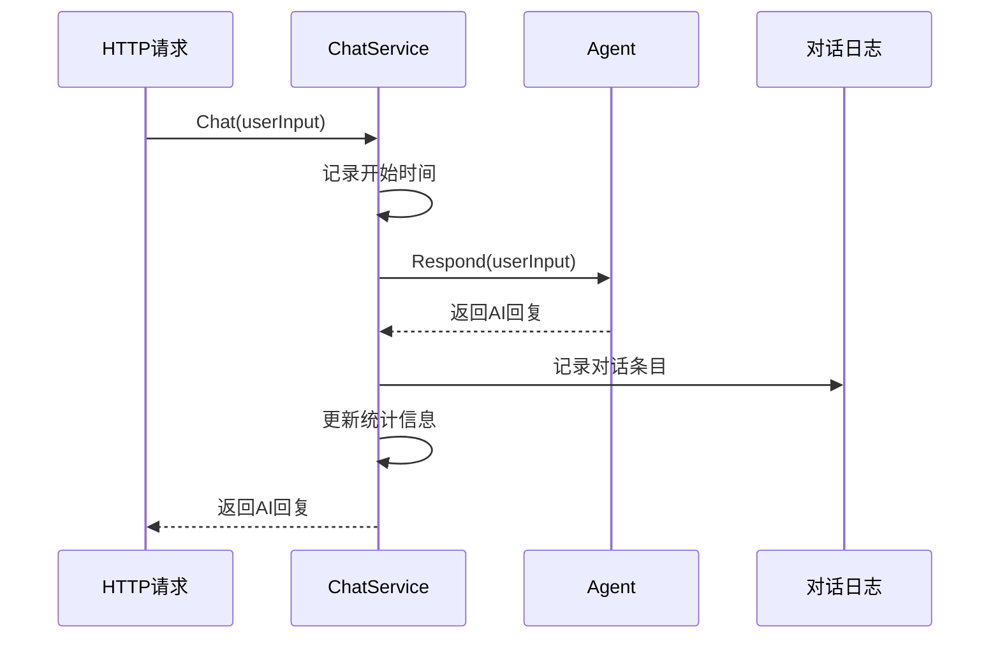
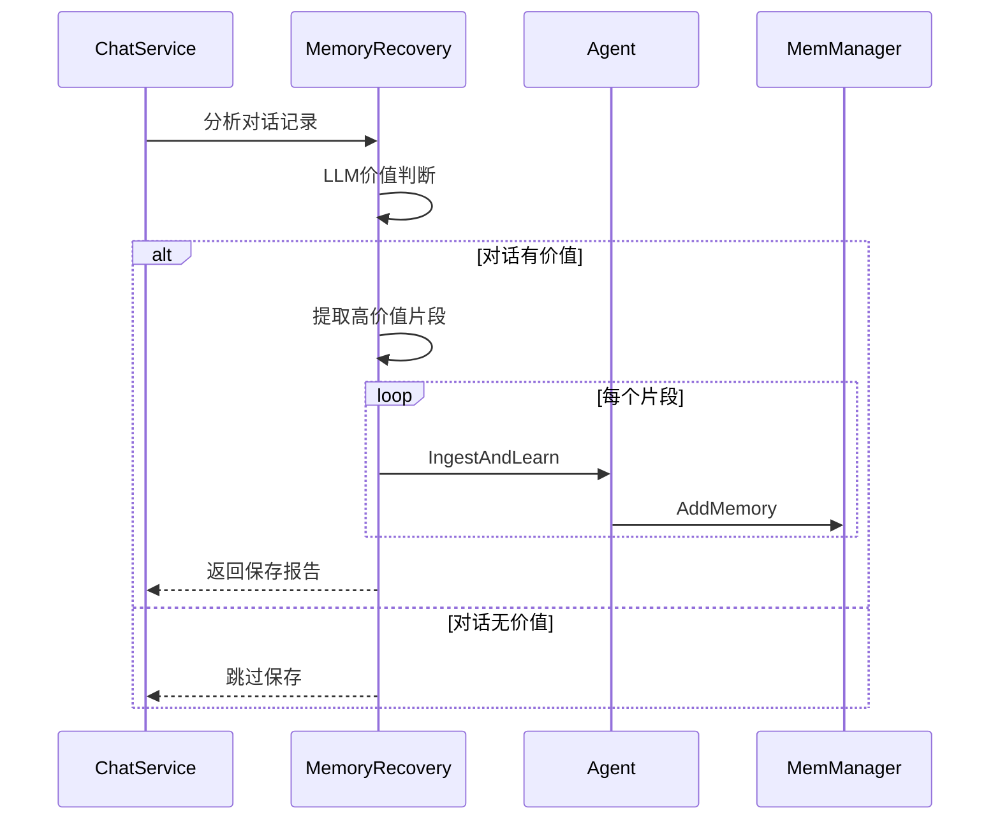
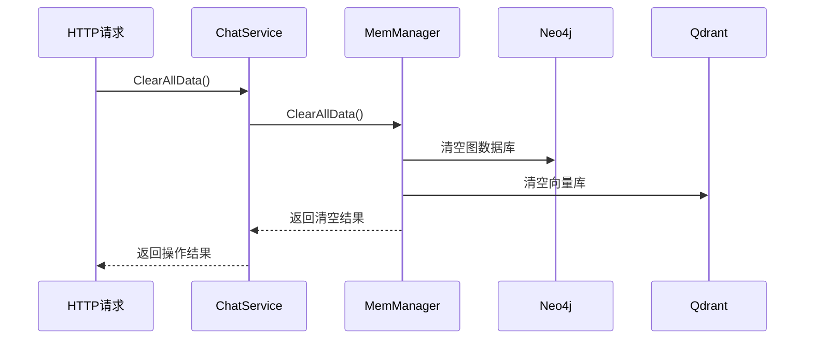

# 🎯 Service模块

Service模块是业务逻辑层，负责协调Agent、记忆管理、对话记录等核心业务功能，是HTTP API和底层组件之间的桥梁。

## 📋 模块职责

### 🎯 核心功能
- **对话管理** - 处理用户对话请求
- **记忆回收** - 智能保存有价值的对话内容
- **状态统计** - 维护服务运行状态和统计信息
- **资源协调** - 协调Agent和MemManager的使用

## 🏗️ 架构设计

```
┌─────────────────────────────────────┐
│           Chat Service              │
├─────────────────────────────────────┤
│  • Chat()                           │
│  • SaveConversationToMemory()       │
│  • GetStatus()                      │
│  • ClearAllData()                   │
└─────────────┬───────────────────────┘
              │
    ┌─────────┼─────────┐
    │         │         │
┌───▼────┐ ┌──▼──┐ ┌───▼────┐
│ Agent  │ │MemMgr│ │ Tools  │
│        │ │      │ │        │
│• 对话  │ │• 记忆│ │• 回收  │
│• 工具  │ │• 搜索│ │• 分析  │
└────────┘ └─────┘ └────────┘
```

## 🔧 核心接口

### ChatService结构体
```go
type ChatService struct {
    agent           *agent.Agent
    memManager      memManager.Manager
    conversationLog []ConversationEntry
    mu              sync.RWMutex
    startTime       time.Time
    messageCount    int
}
```

### 主要方法
```go
// 处理对话
func (s *ChatService) Chat(ctx context.Context, userInput string) (string, error)

// 保存对话到记忆
func (s *ChatService) SaveConversationToMemory(ctx context.Context) error

// 获取服务状态
func (s *ChatService) GetStatus() ServiceStatus

// 清空所有数据
func (s *ChatService) ClearAllData(ctx context.Context) error

// 关闭服务
func (s *ChatService) Close()
```

## 📊 数据结构

### ConversationEntry
```go
type ConversationEntry struct {
    Timestamp time.Time `json:"timestamp"`
    UserInput string    `json:"user_input"`
    AIReply   string    `json:"ai_reply"`
    Duration  string    `json:"duration"`
}
```

### ServiceStatus
```go
type ServiceStatus struct {
    Status           string    `json:"status"`
    Uptime           string    `json:"uptime"`
    MessageCount     int       `json:"message_count"`
    ConversationSize int       `json:"conversation_size"`
    LastActivity     time.Time `json:"last_activity"`
}
```

## 🔄 核心流程

### 对话处理流程


### 记忆回收流程


### 数据清空流程


## 🛠️ 核心方法详解

### Chat方法
```go
func (s *ChatService) Chat(ctx context.Context, userInput string) (string, error)
```

**功能**: 处理用户对话请求
**处理流程**:
1. 记录请求开始时间
2. 调用Agent处理对话
3. 记录对话到日志
4. 更新统计信息
5. 返回AI回复

**并发安全**: 使用读写锁保护共享状态

### SaveConversationToMemory方法
```go
func (s *ChatService) SaveConversationToMemory(ctx context.Context) error
```

**功能**: 智能保存对话到长期记忆
**保存策略**:
1. 分析对话记录的价值
2. 提取高价值片段
3. 转换为结构化知识
4. 存储到记忆管理器

**触发时机**:
- 程序优雅退出时
- 对话记录达到一定数量时
- 手动触发保存时

### GetStatus方法
```go
func (s *ChatService) GetStatus() ServiceStatus
```

**功能**: 获取服务运行状态
**统计信息**:
- 服务运行时间
- 处理的消息数量
- 对话记录大小
- 最后活动时间

### ClearAllData方法
```go
func (s *ChatService) ClearAllData(ctx context.Context) error
```

**功能**: 清空所有记忆数据
**清空范围**:
- Neo4j图数据库
- Qdrant向量数据库
- 不影响当前对话记录

**安全特性**:
- 详细的操作日志
- 错误处理和回滚
- 操作确认机制

## 📈 性能特性

### 并发安全
- 使用读写锁保护共享状态
- 支持多个并发对话请求
- 线程安全的统计更新

### 内存管理
- 对话记录自动清理
- 避免内存泄露
- 合理的缓存策略

### 错误处理
- 完整的错误传播
- 详细的错误日志
- 优雅的降级处理

## 🧪 测试

### 单元测试
```bash
go test ./internal/service
```

### 集成测试
```bash
# 测试完整对话流程
go run test_chat_service.go

# 测试记忆回收
go run test_memory_recovery.go
```

### 性能测试
```bash
# 并发对话测试
go test -bench=BenchmarkChat ./internal/service
```

## 📝 使用示例

### 基本使用
```go
// 创建服务
service, err := service.New(ctx)
if err != nil {
    log.Fatal(err)
}
defer service.Close()

// 处理对话
reply, err := service.Chat(ctx, "你好，我是张三")
if err != nil {
    log.Fatal(err)
}
fmt.Println("AI回复:", reply)

// 获取状态
status := service.GetStatus()
fmt.Printf("运行时间: %s, 消息数: %d\n", 
    status.Uptime, status.MessageCount)
```

### 记忆管理
```go
// 保存对话到记忆
err = service.SaveConversationToMemory(ctx)
if err != nil {
    log.Printf("保存记忆失败: %v", err)
}

// 清空所有数据
err = service.ClearAllData(ctx)
if err != nil {
    log.Printf("清空数据失败: %v", err)
}
```

### 状态监控
```go
// 定期检查状态
ticker := time.NewTicker(30 * time.Second)
defer ticker.Stop()

for range ticker.C {
    status := service.GetStatus()
    log.Printf("服务状态: %s, 运行时间: %s, 消息数: %d", 
        status.Status, status.Uptime, status.MessageCount)
}
```

## 🔗 依赖关系

### 外部依赖
- **sync包**: 并发安全控制
- **time包**: 时间处理和统计

### 内部依赖
- **Agent**: AI对话处理
- **MemManager**: 记忆管理
- **Tools**: 记忆回收工具

## ⚠️ 注意事项

### 资源管理
- 及时关闭Agent和MemManager
- 避免goroutine泄露
- 合理控制对话记录大小

### 错误处理
- 区分可恢复和不可恢复错误
- 提供详细的错误上下文
- 避免错误信息泄露敏感数据

### 性能优化
- 合理使用读写锁
- 避免长时间持有锁
- 异步处理非关键操作

### 数据一致性
- 确保对话记录的完整性
- 处理并发更新冲突
- 维护统计信息的准确性
